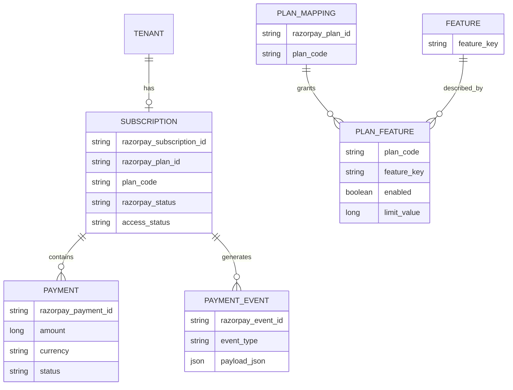
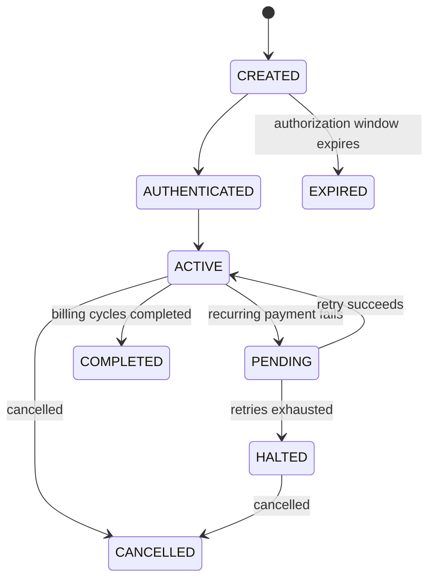
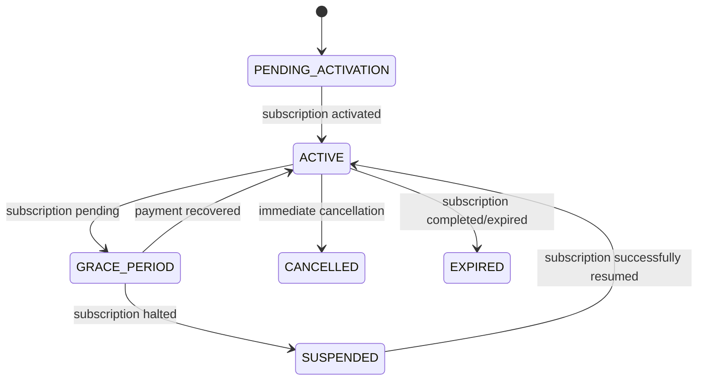

# Razorpay SaaS Billing & Entitlement Design

## 1. Goal

This design keeps responsibilities clean:

- **Razorpay owns billing configuration**: plan price, currency, billing interval, subscription charging, payment processing.
- **Your SaaS owns product access**: which features a plan unlocks, quotas, limits, permissions, grace-period rules.
- **Your DB stores current subscription state** for fast authorization checks.
- **Your DB stores webhook/event history** for audit, debugging, retries, and reconciliation.
- **Do not use Razorpay plan names as authorization keys.** Use stable Razorpay Plan IDs mapped to your own stable internal plan code.

---

# 2. Source of Truth

| Concern | Source of Truth | Store Locally? |
|---|---|---:|
| Plan price | Razorpay | Optional cache only |
| Currency | Razorpay | Optional snapshot |
| Billing frequency | Razorpay | Optional snapshot |
| Razorpay Plan ID | Razorpay | Yes, as reference |
| Subscription ID | Razorpay | Yes |
| Payment ID | Razorpay | Yes |
| Current Razorpay subscription status | Razorpay | Yes, synchronized |
| Current SaaS access status | Your SaaS | Yes |
| Feature access | Your SaaS | Yes |
| Usage limits | Your SaaS | Yes |
| Grace-period policy | Your SaaS | Yes |
| Webhook/event history | Both systems have logs | Yes, keep your copy |
| Raw webhook payload | Razorpay originated | Yes |
| Payment amount actually charged | Razorpay | Yes, snapshot per payment |
| Refund status | Razorpay | Yes, synchronized |

---

# 3. Why Feature Gates Should Be in Your DB

Razorpay Plans support billing-oriented fields such as:

- plan ID
- plan name
- amount
- currency
- billing interval
- billing period
- description
- notes / metadata

Razorpay `notes` can hold key-value metadata, but they are **not an entitlement-management system**.

Do **not** model this only in Razorpay:

```text
Basic -> 5 employees
Pro -> 25 employees
Enterprise -> unlimited employees
```

or:

```text
Basic -> no analytics
Pro -> analytics
Enterprise -> analytics + API + audit logs
```

Those rules belong to your SaaS.

Recommended split:

```text
Razorpay
--------
plan_ABCD
₹999/month

Your DB
-------
plan_ABCD -> STARTER

STARTER:
  employees.max = 5
  vehicles.max = 10
  analytics = false
  exports = false
```

This prevents your product authorization from depending on Razorpay API availability.

---

# 4. Never Gate by Plan Name

Avoid:

```java
if (subscription.getPlanName().equals("Pro")) {
    allowAnalytics();
}
```

Plan names are presentation data and may change.

Use:

```text
Razorpay plan ID
      |
      v
Internal plan code
      |
      v
Entitlements
```

Example:

```text
plan_Q123abc -> STARTER
plan_Q456def -> GROWTH
plan_Q789ghi -> BUSINESS
```

Then:

```java
if (entitlementService.hasFeature(tenantId, "ADVANCED_ANALYTICS")) {
    allowAnalytics();
}
```

---

# 5. Recommended Database Entities

## 5.1 `subscription`

One row represents the **current state** of a customer's subscription.

```sql
CREATE TABLE subscription (
    id BIGINT PRIMARY KEY AUTO_INCREMENT,

    tenant_id BIGINT NOT NULL,

    razorpay_subscription_id VARCHAR(100) NOT NULL UNIQUE,
    razorpay_plan_id VARCHAR(100) NOT NULL,

    plan_code VARCHAR(50) NOT NULL,

    razorpay_status VARCHAR(30) NOT NULL,
    access_status VARCHAR(30) NOT NULL,

    current_period_start TIMESTAMP NULL,
    current_period_end TIMESTAMP NULL,

    grace_period_end TIMESTAMP NULL,

    cancel_at_period_end BOOLEAN NOT NULL DEFAULT FALSE,

    created_at TIMESTAMP NOT NULL,
    updated_at TIMESTAMP NOT NULL,

    INDEX idx_subscription_tenant (tenant_id),
    INDEX idx_subscription_plan (razorpay_plan_id)
);
```

### Suggested `razorpay_status`

```text
CREATED
AUTHENTICATED
ACTIVE
PENDING
HALTED
CANCELLED
COMPLETED
EXPIRED
```

Keep this close to Razorpay's actual subscription state.

### Suggested `access_status`

This is **your business state**, independent of Razorpay terminology.

```text
PENDING_ACTIVATION
ACTIVE
GRACE_PERIOD
SUSPENDED
CANCELLED
EXPIRED
```

Example:

```text
razorpay_status = PENDING
access_status   = GRACE_PERIOD
```

The payment may currently be failing, while you still allow the customer 3 days to recover.

---

# 5.2 `plan_mapping`

You do not need to duplicate the Razorpay price here.

This table tells your application what a Razorpay plan **means**.

```sql
CREATE TABLE plan_mapping (
    id BIGINT PRIMARY KEY AUTO_INCREMENT,

    razorpay_plan_id VARCHAR(100) NOT NULL UNIQUE,
    plan_code VARCHAR(50) NOT NULL UNIQUE,

    display_name VARCHAR(100) NULL,

    active BOOLEAN NOT NULL DEFAULT TRUE,

    created_at TIMESTAMP NOT NULL,
    updated_at TIMESTAMP NOT NULL
);
```

Example:

| razorpay_plan_id | plan_code |
|---|---|
| `plan_xyz1` | `STARTER` |
| `plan_xyz2` | `GROWTH` |
| `plan_xyz3` | `BUSINESS` |

`display_name` is optional.

Your checkout/pricing page can still fetch current price, currency and billing interval from Razorpay.

---

# 5.3 `feature`

Master list of product capabilities.

```sql
CREATE TABLE feature (
    id BIGINT PRIMARY KEY AUTO_INCREMENT,

    feature_key VARCHAR(100) NOT NULL UNIQUE,
    description VARCHAR(255),

    created_at TIMESTAMP NOT NULL
);
```

Examples:

```text
EMPLOYEE_MANAGEMENT
VEHICLE_MANAGEMENT
ADVANCED_ANALYTICS
CSV_EXPORT
API_ACCESS
CUSTOM_BRANDING
AUDIT_LOGS
WHATSAPP_NOTIFICATIONS
```

---

# 5.4 `plan_feature`

Maps plans to entitlements.

```sql
CREATE TABLE plan_feature (
    id BIGINT PRIMARY KEY AUTO_INCREMENT,

    plan_code VARCHAR(50) NOT NULL,
    feature_key VARCHAR(100) NOT NULL,

    enabled BOOLEAN NOT NULL DEFAULT TRUE,

    limit_value BIGINT NULL,

    UNIQUE(plan_code, feature_key)
);
```

Examples:

| plan_code | feature_key | enabled | limit_value |
|---|---|---:|---:|
| STARTER | EMPLOYEE_MANAGEMENT | true | 5 |
| STARTER | VEHICLE_MANAGEMENT | true | 10 |
| STARTER | ADVANCED_ANALYTICS | false | NULL |
| GROWTH | EMPLOYEE_MANAGEMENT | true | 25 |
| GROWTH | ADVANCED_ANALYTICS | true | NULL |
| BUSINESS | EMPLOYEE_MANAGEMENT | true | NULL |
| BUSINESS | API_ACCESS | true | NULL |

Recommended convention:

```text
limit_value = NULL
```

can mean "unlimited" for limit-based features.

---

# 5.5 `payment`

Store each actual payment transaction.

Do not store only the latest payment.

```sql
CREATE TABLE payment (
    id BIGINT PRIMARY KEY AUTO_INCREMENT,

    subscription_id BIGINT NOT NULL,

    razorpay_payment_id VARCHAR(100) NOT NULL UNIQUE,
    razorpay_order_id VARCHAR(100) NULL,
    razorpay_invoice_id VARCHAR(100) NULL,

    amount BIGINT NOT NULL,
    currency VARCHAR(10) NOT NULL,

    status VARCHAR(30) NOT NULL,

    paid_at TIMESTAMP NULL,

    created_at TIMESTAMP NOT NULL,
    updated_at TIMESTAMP NOT NULL,

    FOREIGN KEY (subscription_id) REFERENCES subscription(id)
);
```

Possible payment statuses:

```text
CREATED
AUTHORIZED
CAPTURED
FAILED
REFUNDED
```

The exact fields/events you use should match the Razorpay products enabled on your account.

---

# 5.6 `payment_event`

Keep every **meaningful webhook event**.

This is append-only.

```sql
CREATE TABLE payment_event (
    id BIGINT PRIMARY KEY AUTO_INCREMENT,

    razorpay_event_id VARCHAR(150) NOT NULL UNIQUE,

    event_type VARCHAR(100) NOT NULL,

    razorpay_subscription_id VARCHAR(100) NULL,
    razorpay_payment_id VARCHAR(100) NULL,

    processing_status VARCHAR(30) NOT NULL,

    payload_json JSON NOT NULL,

    received_at TIMESTAMP NOT NULL,
    processed_at TIMESTAMP NULL,

    error_message TEXT NULL
);
```

Suggested processing statuses:

```text
RECEIVED
PROCESSED
IGNORED
FAILED
```

Razorpay may deliver the same webhook more than once. Use the `x-razorpay-event-id` header as an idempotency/deduplication key.

---

# 6. Recommended Entity Relationship



---

# 7. Subscription Lifecycle

A simplified production flow:



Your SaaS access state can be different:



---

# 8. Webhook -> Database Update Matrix

## Subscription events

| Razorpay event | `subscription.razorpay_status` | `subscription.access_status` | Other action |
|---|---|---|---|
| `subscription.created` | CREATED | PENDING_ACTIVATION | Log event |
| `subscription.authenticated` | AUTHENTICATED | PENDING_ACTIVATION | Log event |
| `subscription.activated` | ACTIVE | ACTIVE | Update billing dates |
| `subscription.charged` | ACTIVE | ACTIVE | Update period/payment data |
| `subscription.pending` | PENDING | GRACE_PERIOD | Set grace-period deadline |
| `subscription.halted` | HALTED | SUSPENDED | Disable paid access |
| `subscription.cancelled` | CANCELLED | CANCELLED | Disable access according to cancellation policy |
| `subscription.completed` | COMPLETED | EXPIRED | Disable renewal-based access |
| subscription expiry event/state | EXPIRED | EXPIRED | Disable access |

Exact webhook availability should be verified against the events enabled in your Razorpay account.

---

# 9. Payment Event -> Database Update Matrix

| Event | Payment row | Subscription access |
|---|---|---|
| `payment.authorized` | status = AUTHORIZED | No access decision by itself |
| `payment.captured` | status = CAPTURED | Usually no direct subscription decision by itself |
| `payment.failed` | status = FAILED | Do **not** immediately cancel access |
| refund created/processed | update refund/payment state | Apply your refund policy |

The **subscription lifecycle event** should normally decide subscription access.

Do not write:

```java
if ("payment.failed".equals(eventType)) {
    subscription.setAccessStatus(SUSPENDED);
}
```

A recurring payment may be retried.

Instead:

```text
payment.failed
      |
      v
record failed attempt

subscription.pending
      |
      v
GRACE_PERIOD

subscription.halted
      |
      v
SUSPENDED
```

---

# 10. Recurring Payment Scenarios

## Scenario A - Normal successful renewal

Starting state:

```text
razorpay_status = ACTIVE
access_status   = ACTIVE
```

Recurring charge succeeds.

Typical meaningful events may include:

```text
payment.authorized
payment.captured
subscription.charged
```

Final state:

```text
razorpay_status = ACTIVE
access_status   = ACTIVE
```

Actions:

1. Append all relevant webhook events.
2. Upsert the payment.
3. Mark payment CAPTURED.
4. Update period information from the subscription payload/API if necessary.
5. Keep access ACTIVE.

---

## Scenario B - First renewal payment fails

Events may include:

```text
payment.failed
subscription.pending
```

Update:

```text
razorpay_status = PENDING
access_status   = GRACE_PERIOD
grace_period_end = now + configured grace duration
```

Do not immediately cancel the customer.

---

## Scenario C - Retry succeeds

Possible state event:

```text
subscription.activated
```

and successful payment events.

Update:

```text
razorpay_status = ACTIVE
access_status   = ACTIVE
grace_period_end = NULL
```

---

## Scenario D - All payment retries fail

Event:

```text
subscription.halted
```

Update:

```text
razorpay_status = HALTED
access_status   = SUSPENDED
```

Paid endpoints/features should now be rejected.

---

## Scenario E - Customer cancels immediately

Event/state:

```text
subscription.cancelled
```

Update:

```text
razorpay_status = CANCELLED
access_status   = CANCELLED
```

---

## Scenario F - Cancel at end of billing period

Your application may keep:

```text
razorpay_status = ACTIVE
access_status = ACTIVE
cancel_at_period_end = true
```

until the effective cancellation/end date.

At the actual end:

```text
access_status = CANCELLED
```

Use the authoritative state/timestamps returned by Razorpay rather than deriving billing dates only from your own clock.

---

## Scenario G - Subscription naturally finishes

If the configured billing-cycle count is completed:

```text
razorpay_status = COMPLETED
access_status   = EXPIRED
```

unless your product explicitly grants permanent access.

---

## Scenario H - Duplicate webhook

Razorpay can send the same webhook more than once.

Incoming:

```text
x-razorpay-event-id = abc123
```

Check:

```sql
SELECT 1
FROM payment_event
WHERE razorpay_event_id = 'abc123';
```

If already present:

```text
return HTTP 200
```

without processing the business state again.

---

# 11. Webhook Processing Algorithm

Recommended flow:

```text
Razorpay
   |
   | POST webhook
   v
Webhook Controller
   |
   +--> Verify HMAC signature
   |
   +--> Read x-razorpay-event-id
   |
   +--> Already processed?
   |       |
   |       +--> Yes -> HTTP 200
   |
   +--> Insert payment_event(RECEIVED)
   |
   +--> Process business event
   |
   +--> Update subscription/payment
   |
   +--> Mark payment_event(PROCESSED)
   |
   +--> HTTP 200
```

Pseudo-code:

```java
@Transactional
public void handleWebhook(
        String eventId,
        String eventType,
        String payload
) {

    if (paymentEventRepository.existsByRazorpayEventId(eventId)) {
        return;
    }

    PaymentEvent event = paymentEventRepository.save(
        PaymentEvent.received(eventId, eventType, payload)
    );

    try {
        switch (eventType) {

            case "subscription.activated" ->
                subscriptionService.activate(payload);

            case "subscription.pending" ->
                subscriptionService.moveToGracePeriod(payload);

            case "subscription.halted" ->
                subscriptionService.suspend(payload);

            case "subscription.cancelled" ->
                subscriptionService.cancel(payload);

            case "subscription.completed" ->
                subscriptionService.complete(payload);

            case "payment.authorized",
                 "payment.captured",
                 "payment.failed" ->
                paymentService.updatePayment(payload);

            default ->
                event.markIgnored();
        }

        event.markProcessed();

    } catch (Exception ex) {
        event.markFailed(ex.getMessage());
        throw ex;
    }
}
```

---

# 12. Feature Gating

## Boolean feature

Example:

```text
ADVANCED_ANALYTICS
```

Starter:

```text
enabled = false
```

Growth:

```text
enabled = true
```

Service:

```java
public boolean hasFeature(Long tenantId, String featureKey) {

    Subscription subscription =
        subscriptionRepository.findCurrentByTenantId(tenantId)
            .orElseThrow();

    if (!subscription.canAccessPaidFeatures()) {
        return false;
    }

    return planFeatureRepository
        .isEnabled(subscription.getPlanCode(), featureKey);
}
```

Usage:

```java
if (!entitlementService.hasFeature(
        tenantId,
        "ADVANCED_ANALYTICS"
)) {
    throw new FeatureNotAvailableException();
}
```

---

# 13. Quota / Limit Gating

Example:

```text
STARTER -> max 5 employees
GROWTH  -> max 25 employees
BUSINESS -> unlimited
```

DB:

```text
STARTER | EMPLOYEE_MANAGEMENT | true | 5
GROWTH  | EMPLOYEE_MANAGEMENT | true | 25
BUSINESS| EMPLOYEE_MANAGEMENT | true | NULL
```

Check:

```java
public void assertCanAddEmployee(Long tenantId) {

    Long limit = entitlementService.getLimit(
        tenantId,
        "EMPLOYEE_MANAGEMENT"
    );

    if (limit == null) {
        return; // unlimited
    }

    long currentEmployees =
        employeeRepository.countByTenantId(tenantId);

    if (currentEmployees >= limit) {
        throw new PlanLimitExceededException();
    }
}
```

---

# 14. Recommended Spring Domain Model

```java
enum RazorpaySubscriptionStatus {
    CREATED,
    AUTHENTICATED,
    ACTIVE,
    PENDING,
    HALTED,
    CANCELLED,
    COMPLETED,
    EXPIRED
}
```

```java
enum AccessStatus {
    PENDING_ACTIVATION,
    ACTIVE,
    GRACE_PERIOD,
    SUSPENDED,
    CANCELLED,
    EXPIRED
}
```

```java
enum PaymentStatus {
    CREATED,
    AUTHORIZED,
    CAPTURED,
    FAILED,
    REFUNDED
}
```

Do not create a Java enum containing every plan:

```java
enum Plan {
    STARTER,
    PRO,
    ENTERPRISE
}
```

if you expect plans to be created dynamically.

Prefer a DB-controlled:

```text
plan_code
```

so adding a new commercial plan does not require a deployment.

---

# 15. Example Plan Setup

Razorpay:

```text
Plan ID: plan_starter123
Name: Starter Monthly
Price: ₹999
Period: monthly
```

Your DB:

```text
plan_mapping

razorpay_plan_id = plan_starter123
plan_code         = STARTER
```

Entitlements:

```text
STARTER
├── EMPLOYEE_MANAGEMENT      max 5
├── VEHICLE_MANAGEMENT       max 10
├── WHATSAPP_NOTIFICATIONS   max 100/month
├── CSV_EXPORT               false
├── ADVANCED_ANALYTICS       false
└── API_ACCESS               false
```

Razorpay:

```text
Plan ID: plan_growth456
Name: Growth Monthly
Price: ₹2499
Period: monthly
```

Your DB:

```text
plan_growth456 -> GROWTH
```

Entitlements:

```text
GROWTH
├── EMPLOYEE_MANAGEMENT      max 25
├── VEHICLE_MANAGEMENT       max 50
├── WHATSAPP_NOTIFICATIONS   max 1000/month
├── CSV_EXPORT               true
├── ADVANCED_ANALYTICS       true
└── API_ACCESS               false
```

---

# 16. Pricing Page Flow

Because you want Razorpay to remain the pricing source of truth:

```text
Frontend
    |
    v
GET /api/plans
    |
    v
Your Backend
    |
    +--> Read active plan mappings
    |
    +--> Fetch plans from Razorpay
    |
    +--> Match by razorpay_plan_id
    |
    +--> Load local entitlements
    |
    v
Return combined DTO
```

Example response:

```json
[
  {
    "planCode": "STARTER",
    "razorpayPlanId": "plan_starter123",
    "name": "Starter Monthly",
    "amount": 99900,
    "currency": "INR",
    "interval": 1,
    "period": "monthly",
    "features": {
      "EMPLOYEE_MANAGEMENT": 5,
      "VEHICLE_MANAGEMENT": 10,
      "ADVANCED_ANALYTICS": false,
      "CSV_EXPORT": false
    }
  }
]
```

This gives you:

```text
Price             -> Razorpay
Billing frequency -> Razorpay
Feature access    -> Your DB
```

without duplicating billing configuration.

---

# 17. Do You Need a Local `plan` Entity?

Not necessarily.

For your current architecture, this is enough:

```text
plan_mapping
plan_feature
feature
```

You do **not** need to store:

```text
amount
currency
billing period
```

unless you deliberately want caching or historical snapshots.

Recommended:

```text
Razorpay price -> fetched from Razorpay
Internal plan meaning -> your DB
```

---

# 18. Historical Price Snapshot

There is one reason to store the amount on the **payment** row even though Razorpay owns pricing.

Suppose:

```text
September:
Growth = ₹1,999

January:
Growth = ₹2,499
```

An old payment must still show:

```text
₹1,999 paid in September
```

Therefore:

```text
plan price configuration -> Razorpay only
actual charged amount -> payment table
```

That is not duplicate source-of-truth data; it is a transaction snapshot.

---

# 19. Should Features Be Stored in Razorpay `notes`?

You technically could store small metadata like:

```json
{
  "tier": "GROWTH",
  "internal_code": "GROWTH"
}
```

in Razorpay notes.

Using notes as the actual entitlement store is not recommended.

Avoid:

```json
{
  "max_employees": "25",
  "max_vehicles": "50",
  "analytics": "true",
  "csv": "true",
  "whatsapp_limit": "1000",
  "api_access": "false"
}
```

Reasons:

1. Razorpay is a billing provider, not your authorization system.
2. Your API would become dependent on remote billing data for feature checks.
3. Entitlement changes become harder to manage/version.
4. Notes have limits and are generic metadata.
5. Your product features are business logic, not payment configuration.

Good use of Razorpay notes:

```text
internal_plan_code = GROWTH
environment = prod
```

But your DB should still own the actual feature rules.

---

# 20. Recommended Access Decision

Every request should **not** call Razorpay.

Bad:

```text
GET /employees
    |
    +--> call Razorpay
    +--> fetch subscription
    +--> fetch plan
    +--> decide access
```

Good:

```text
GET /employees
    |
    +--> read local subscription
    +--> read/cache entitlements
    +--> authorize
```

Razorpay synchronizes billing state through webhooks.

---

# 21. Suggested Authorization Flow

```text
Authenticated Tenant
        |
        v
Subscription exists?
        |
       No -----> reject / free tier
        |
       Yes
        |
        v
Access status?
        |
        +--> ACTIVE ------+
        |                 |
        +--> GRACE_PERIOD +--> continue
        |
        +--> SUSPENDED ------> reject paid feature
        |
        +--> CANCELLED ------> reject paid feature
        |
        v
Resolve plan_code
        |
        v
Resolve plan_feature
        |
        v
Feature enabled?
        |
       No -----> 403 FEATURE_NOT_AVAILABLE
        |
       Yes
        |
        v
Quota exceeded?
        |
       Yes ----> 409/403 PLAN_LIMIT_EXCEEDED
        |
       No
        |
        v
Allow
```

---

# 22. Upgrade / Downgrade

Do not hard-code:

```text
PRO > BASIC
```

Represent subscriptions and plan mappings separately.

When changing plans:

1. Ask Razorpay to perform/update the subscription according to the billing behavior you want.
2. Wait for authoritative Razorpay response/webhook.
3. Update `razorpay_plan_id`.
4. Resolve the new `plan_code`.
5. New entitlements take effect according to your policy.

For example:

```text
plan_old123 -> STARTER
plan_new456 -> GROWTH
```

After the plan change becomes effective:

```text
subscription.razorpay_plan_id = plan_new456
subscription.plan_code = GROWTH
```

Feature checks automatically use Growth entitlements.

---

# 23. Grace Period Recommendation

Example configuration:

```text
payment_grace_period_days = 3
```

When:

```text
subscription.pending
```

set:

```text
access_status = GRACE_PERIOD
grace_period_end = now + 3 days
```

If payment recovers:

```text
subscription.activated

access_status = ACTIVE
grace_period_end = NULL
```

If retries are exhausted:

```text
subscription.halted

access_status = SUSPENDED
```

Whether you wait until your own `grace_period_end` or suspend immediately on `HALTED` is a product/business policy.

---

# 24. What Must Be Idempotent

These operations must safely tolerate duplicate webhooks:

```text
Activate subscription
Record captured payment
Mark failed payment
Enter grace period
Suspend account
Cancel subscription
Process refund
```

Never assume:

```text
one webhook = one HTTP request
```

Treat delivery as:

```text
at least once
```

and deduplicate using the Razorpay event ID.

---

# 25. Recommended Minimal Production Schema

If you want to keep this lean, start with only:

```text
subscription
plan_mapping
feature
plan_feature
payment
payment_event
```

That is enough for a strong first production version.

You do not need:

```text
local Razorpay plan clone
local invoice clone
local order clone
local Razorpay customer clone
```

unless your business later requires those records.

---

# 26. Final Recommended Architecture

```text
                    ┌─────────────────────────┐
                    │        Razorpay         │
                    │                         │
                    │ Price                   │
                    │ Currency                │
                    │ Billing frequency       │
                    │ Subscription charging   │
                    │ Payments                │
                    └────────────┬────────────┘
                                 │
                              webhooks
                                 │
                                 ▼
                    ┌─────────────────────────┐
                    │      Billing Service    │
                    │                         │
                    │ Verify signature        │
                    │ Deduplicate event       │
                    │ Process state changes   │
                    └────────────┬────────────┘
                                 │
            ┌────────────────────┼────────────────────┐
            │                    │                    │
            ▼                    ▼                    ▼
      subscription            payment           payment_event
      current state        transactions          audit trail

            │
            │ razorpay_plan_id
            ▼
       plan_mapping
            │
            │ plan_code
            ▼
       plan_feature
            │
            ▼
          feature

            │
            ▼
      EntitlementService
            │
            ▼
        SaaS APIs
```

---

# 27. Responsibility Summary

### Razorpay owns

```text
How much?
How often?
Was money successfully charged?
What is the external subscription state?
```

### Your SaaS owns

```text
What can this customer use?
How many resources can they create?
Does a failed payment get a grace period?
When should product access be suspended?
Which internal product tier corresponds to a Razorpay plan?
```

### Your DB should store

```text
Current subscription state
Current SaaS access state
Razorpay IDs
Plan ID -> internal plan mapping
Features and limits
Actual payments
Meaningful webhook/event history
```

---

# 28. Recommended Rule

Use this mental model:

```text
Razorpay answers:
"Did the customer pay for plan_X?"

Your SaaS answers:
"What does plan_X allow the customer to do?"
```

Keep those responsibilities separate.

---

# 29. Razorpay Documentation Used

- Razorpay Subscriptions overview:
  https://razorpay.com/subscriptions/

- Create a Plan:
  https://razorpay.com/docs/api/payments/subscriptions/create-plan/

- Plans Entity:
  https://razorpay.com/docs/api/payments/subscriptions/plans-entity/

- Subscription Entity:
  https://razorpay.com/docs/api/payments/subscriptions/entity/

- Create Subscription:
  https://razorpay.com/docs/api/payments/subscriptions/create-subscription/

- Webhook FAQ / duplicate delivery:
  https://razorpay.com/docs/webhooks/faqs/

- Razorpay integration security checklist:
  https://razorpay.com/security/checklist
